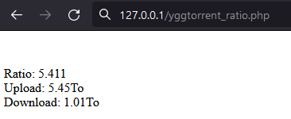

# yggtorrent-get-ratio
yggtorrent-get-ratio vous permet de récupérer votre ratio en PHP

# Installation et configuration

Mettre le fichier yggtorrent_ratio.php sur un serveur PHP

Configurer l'URL et votre compte au début du script :

    $YGGTORRENT_URL="yggtorrent.wtf";
    
    $USER = "the_username";
    $PASSWORD = "the_password";

Executer le script pour afficher votre ratio.

Le code est assez simple pour etre recupéré dans un programme plus complexe (suivi de ratio).
